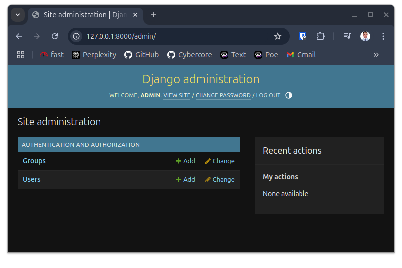
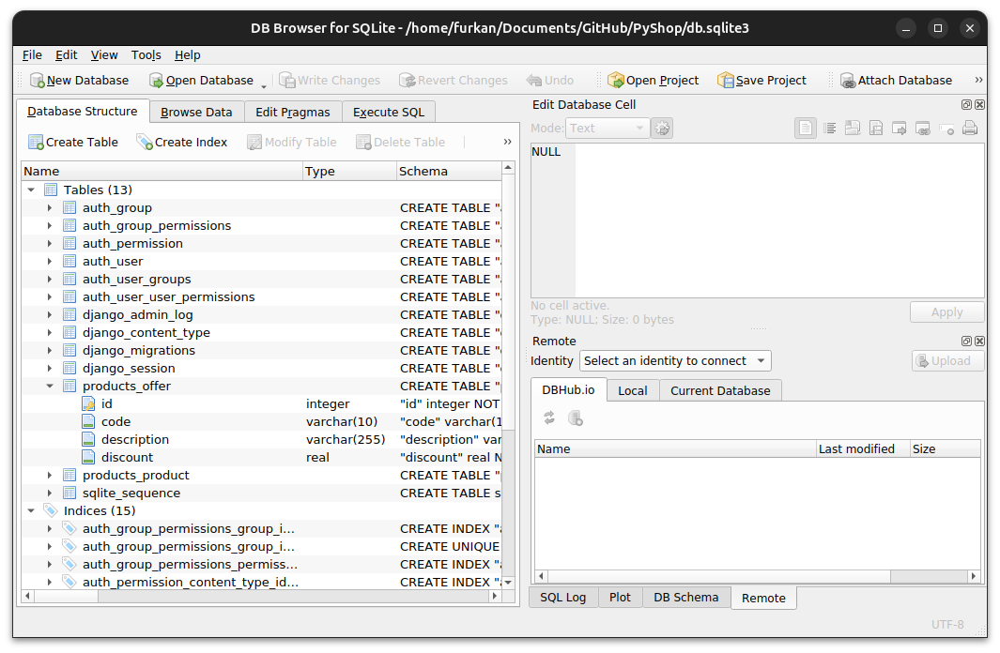
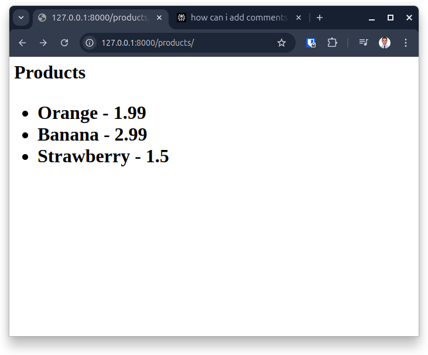

# PyShop - Django E-commerce Project Reference Guide

## Table of Contents
1. [Introduction](#introduction)
2. [Project Setup](#project-setup)
   - [Environment Setup](#environment-setup)
   - [Django Project Creation](#django-project-creation)
   - [Git Repository Setup](#git-repository-setup)
3. [Django App Development](#django-app-development)
   - [Creating the Products App](#creating-the-products-app)
   - [URL Mapping and Views](#url-mapping-and-views)
   - [Models and Database Design](#models-and-database-design)
   - [Database Migrations](#database-migrations)
4. [Admin Interface Customization](#admin-interface-customization)
   - [Admin Panel Setup](#admin-panel-setup)
   - [Customizing Model Display](#customizing-model-display)
5. [Frontend Development](#frontend-development)
   - [Basic Templates](#basic-templates)
   - [Template Enhancement](#template-enhancement)
6. [Collaborative Workflow](#collaborative-workflow)
   - [Git Workflow Best Practices](#git-workflow-best-practices)
   - [Handling Merge Conflicts](#handling-merge-conflicts)
7. [Additional Resources](#additional-resources)

## Introduction

PyShop is a Django-based e-commerce project that demonstrates fundamental Django concepts. This README serves as a comprehensive notebook for my learning journey with Django, documenting each step of the development process with detailed explanations of key concepts.

Throughout this document, I've captured the evolution of the project from a simple structure to a more complex application, including command-line inputs, code snippets, and explanations of core Django concepts.

## Project Setup

### Environment Setup

I started by setting up a clean development environment with a virtual environment to isolate dependencies:

```bash
# Create a new directory for the project
mkdir PyShop
cd PyShop/

# Create and activate a virtual environment
python3 -m venv venv
source venv/bin/activate

# Install Django
pip install django

# Verify Django installation
python -m django --version
```

> **Note:** The virtual environment (`venv`) creates an isolated Python environment for the project, ensuring dependencies for this project don't conflict with other projects on the system.

### Django Project Creation

After setting up the environment, I created a new Django project using the `django-admin` command:

```bash
# Create a new Django project called 'pyshop'
django-admin startproject pyshop .

# The '.' at the end creates the project in the current directory
# Without it, a nested directory structure would be created
```

The command generates several key files:
- `manage.py`: A command-line utility for administrative tasks
- `pyshop/settings.py`: Project-wide settings
- `pyshop/urls.py`: URL declarations for the project
- `pyshop/wsgi.py`: WSGI configuration for deployment
- `pyshop/asgi.py`: ASGI configuration for async deployment

I tested the development server to verify everything works:

```bash
# Start the development server
python manage.py runserver
```

The server started at http://127.0.0.1:8000/, showing the default Django welcome page.

### Git Repository Setup

To keep track of changes and follow good development practices, I set up Git version control:

```bash
# Initialize a Git repository
git init

# Create a .gitignore file to exclude unnecessary files
# (I used a standard Python .gitignore from GitHub)
curl -o .gitignore https://raw.githubusercontent.com/github/gitignore/main/Python.gitignore

# Add all files to staging
git add .

# Make the initial commit
git commit -m "Initial commit: Django project setup"

# Create a development branch
git checkout -b dev

# Push to remote repository (assuming the repository was already created on GitHub)
git remote add origin https://github.com/furkancybercore/PyShop.git
git push -u origin dev
```

> **Best Practice:** I'm using a `dev` branch for development and will only merge to `main` when features are complete and tested.

## Django App Development

### Creating the Products App

Django projects consist of multiple apps, each handling a specific function. I created a products app to manage the product listings:

```bash
# Create a new Django app
python manage.py startapp products
```

This command generated several files within a new `products` directory:
- `apps.py`: App configuration
- `models.py`: Data models
- `views.py`: View functions
- `admin.py`: Admin interface configuration
- `migrations/`: Database migration files
- `tests.py`: Testing functions

After creating the app, I registered it in the project's settings to make it available:

**settings.py**:
```python
INSTALLED_APPS = [
    'django.contrib.admin',
    'django.contrib.auth',
    'django.contrib.contenttypes',
    'django.contrib.sessions',
    'django.contrib.messages',
    'django.contrib.staticfiles',
    'products.apps.ProductsConfig',  # Added this line to register the products app
]
```

I then committed these changes:

```bash
git add .
git commit -m "Created products app"
git push
```

### URL Mapping and Views

#### Creating First View

I started by creating a simple view in `products/views.py`:

```python
from django.shortcuts import render
from django.http import HttpResponse

"""
All views functions always take a request object parameter.
When a URL is accessed, HTTP sends a request, and Django passes
this request object to the view function.
"""
def index(request):
    return HttpResponse('Hello World')
```

#### Setting Up URL Patterns

To make the view accessible, I created a new file `products/urls.py` to define URL patterns for the products app:

```python
from django.urls import path
from . import views  # Import views from the same directory

"""
We created a list object to define our URL patterns
"""
urlpatterns = [
    path('', views.index),  # Root path maps to the index view
]
```

#### Connecting to Main URLs

Next, I connected the products app URLs to the main project URLs in `pyshop/urls.py`:

```python
from django.contrib import admin
from django.urls import path, include

urlpatterns = [
    path('admin/', admin.site.urls),
    path('products/', include('products.urls'))  # When user visits /products/, Django will use patterns from products.urls
]
```

I tested this by running the server and visiting http://127.0.0.1:8000/products/, which displayed "Hello World".

#### Adding More Routes

I added a new route for displaying new products:

1. In `products/urls.py`:
```python
urlpatterns = [
    path('', views.index),
    path('new', views.new)  # Maps /products/new/ to the new view
]
```

2. In `products/views.py`:
```python
def new(request):
    return HttpResponse('New Products')
```

I committed these changes:
```bash
git add .
git commit -m "Added URL mapping and basic views"
git push
```

### Models and Database Design

Models define the database structure for the application. I defined two models in `products/models.py`:

```python
from django.db import models

class Product(models.Model):
    """
    Product model represents items for sale in our shop
    """
    name = models.CharField(max_length=255)  # Product name with max length
    price = models.FloatField()  # Price as a decimal number
    stock = models.IntegerField()  # Quantity in stock
    image_url = models.CharField(max_length=2083)  # URL to product image
                                                  # 2083 is max URL length

class Offer(models.Model):
    """
    Offer model represents discount offers for products
    """
    code = models.CharField(max_length=10)  # Coupon code
    description = models.CharField(max_length=255)  # Offer description
    discount = models.FloatField()  # Discount amount
```

> **Note on Fields:** Django provides various field types for different data needs. `CharField` is for strings, `FloatField` for decimals, and `IntegerField` for integers. Each field type maps to a specific database column type.

I committed the model changes:
```bash
git add .
git commit -m "Created Product and Offer models"
git push
```

### Database Migrations

Django uses migrations to update the database schema when models change. After defining the models, I created and applied migrations:

```bash
# Create migrations based on model changes
python manage.py makemigrations
```

Output:
```
Migrations for 'products':
  products/migrations/0001_initial.py
    - Create model Product
    - Create model Offer
```

This command created migration files in `products/migrations/` that define how to update the database.

```bash
# Apply migrations to create database tables
python manage.py migrate
```

Output:
```
Operations to perform:
  Apply all migrations: admin, auth, contenttypes, products, sessions
Running migrations:
  Applying products.0001_initial... OK
```

Let's look at the database structure after migrations:


I committed these changes:
```bash
git add .
git commit -m "Applied database migrations"
git push
```

## Admin Interface Customization

### Admin Panel Setup

Django provides a built-in admin interface. To access it, I first created a superuser:

```bash
# Create a superuser (admin account)
python manage.py createsuperuser
```

When prompted, I entered:
- Username: admin
- Email: admin@example.com
- Password: (a secure password)

I then started the server and accessed the admin interface at http://127.0.0.1:8000/admin/:

```bash
python manage.py runserver
```

The admin interface looked like this initially:



### Customizing Model Display

To make models visible in the admin interface, I updated `products/admin.py`:

```python
from django.contrib import admin
from .models import Product, Offer

class ProductAdmin(admin.ModelAdmin):
    """
    Customizes how Products appear in the admin interface
    """
    list_display = ('name', 'price', 'stock')  # Fields to display in the list view

class OfferAdmin(admin.ModelAdmin):
    """
    Customizes how Offers appear in the admin interface
    """
    list_display = ('code', 'discount')  # Fields to display in the list view

# Register models with the admin site
admin.site.register(Product, ProductAdmin)
admin.site.register(Offer, OfferAdmin)
```

After these changes, the admin interface showed the models with custom displays:


I added some sample products through the admin interface:


And added some offers too:



I committed these changes:
```bash
git add .
git commit -m "Customized admin interface for Products and Offers"
git push
```

## Frontend Development

### Basic Templates

Django uses templates to generate HTML. I created a simple template to display products:

1. First, I created a templates directory:
```bash
mkdir -p products/templates/
```

2. Then I created `products/templates/index.html`:
```html
<h1>Products</h1>
<ul>
    
        <li>{{ product.name }} - ${{ product.price }}</li>
    
</ul>
```

3. Finally, I updated the view to use the template:
```python
from .models import Product

def index(request):
    products = Product.objects.all()  # Fetch all products from database
    return render(request, 'index.html', {'products': products})
    """
    render function:
    1. First argument: request object
    2. Second argument: template name (Django looks in app's templates directory)
    3. Third argument: context dictionary (data to pass to the template)
    """
```

When viewing the page at http://127.0.0.1:8000/products/, it displayed a simple list of products:


I committed these changes:
```bash
git add .
git commit -m "Added basic product template"
git push
```

### Template Enhancement

To improve the UI, I enhanced the template with Bootstrap:

```html
<!DOCTYPE html>
<html>
<head>
    <title>PyShop</title>
    <link href="https://cdn.jsdelivr.net/npm/bootstrap@5.3.0/dist/css/bootstrap.min.css" rel="stylesheet">
</head>
<body>
    <div class="container">
        <div class="row">
            <div class="col">
                <h1 class="mt-4">Products</h1>
                <div class="row">
                    
                        <div class="col-md-4 mb-4">
                            <div class="card">
                                
                                <div class="card-body">
                                    <h5 class="card-title">{{ product.name }}</h5>
                                    <p class="card-text">${{ product.price }}</p>
                                    <p class="card-text">Stock: {{ product.stock }}</p>
                                    <a href="#" class="btn btn-primary">Add to Cart</a>
                                </div>
                            </div>
                        </div>
                    
                </div>
            </div>
        </div>
    </div>
    <script src="https://cdn.jsdelivr.net/npm/bootstrap@5.3.0/dist/js/bootstrap.bundle.min.js"></script>
</body>
</html>
```

The enhanced template provided a much better user experience:



I committed these changes:
```bash
git add .
git commit -m "Enhanced product template with Bootstrap"
git push
```

## Collaborative Workflow

### Git Workflow Best Practices

When working on a team project, it's important to follow a structured Git workflow. Here's my process when collaborating:

1. **Always pull the latest changes before starting work**
   ```bash
   git checkout dev
   git pull origin dev
   ```

2. **Create feature branches for new work**
   ```bash
   git checkout -b feature/product-filtering
   ```

3. **Make frequent, small commits with descriptive messages**
   ```bash
   git add .
   git commit -m "Implemented product filtering by category"
   ```

4. **Push changes to remote repo**
   ```bash
   git push -u origin feature/product-filtering
   ```

5. **Create a pull request on GitHub** to merge changes to the dev branch

6. **After PR approval, merge to dev and eventually to main**
   ```bash
   # After PR is approved
   git checkout dev
   git merge feature/product-filtering
   git push origin dev
   
   # When ready to release
   git checkout main
   git merge dev
   git push origin main
   ```

### Handling Merge Conflicts

If others have made changes to the same files I've modified, I might encounter merge conflicts. Here's how I handle them:

1. **Pull the latest changes and merge them with mine**
   ```bash
   git checkout dev
   git pull origin dev
   git checkout feature/product-filtering
   git merge dev
   ```

2. **If there are conflicts, Git will indicate which files have conflicts**
   ```
   Auto-merging products/views.py
   CONFLICT (content): Merge conflict in products/views.py
   Automatic merge failed; fix conflicts and then commit the result.
   ```

3. **Open the conflicted files and look for conflict markers**
   ```python
   <<<<<<< HEAD
   # My changes
   products = Product.objects.filter(category='fruits')
   =======
   # Remote changes
   products = Product.objects.filter(available=True)
   >>>>>>> dev
   ```

4. **Edit the files to resolve conflicts and remove markers**
   ```python
   # Resolved conflict
   products = Product.objects.filter(category='fruits', available=True)
   ```

5. **After resolving conflicts, add and commit the changes**
   ```bash
   git add .
   git commit -m "Resolved merge conflicts with dev branch"
   git push
   ```

6. **Continue with the pull request process**

## Additional Resources

- [Django Official Documentation](https://docs.djangoproject.com/)
- [Django Model Field Reference](https://docs.djangoproject.com/en/stable/ref/models/fields/)
- [Django Admin Customization](https://docs.djangoproject.com/en/stable/ref/contrib/admin/)
- [Git Workflow Guide](https://www.atlassian.com/git/tutorials/comparing-workflows)

For more detailed information about the code used in this project, see [CODE_REFERENCE.md](CODE_REFERENCE.md).