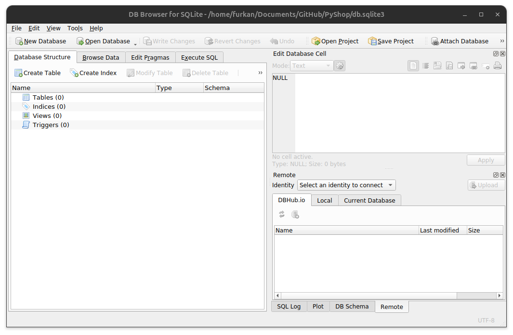
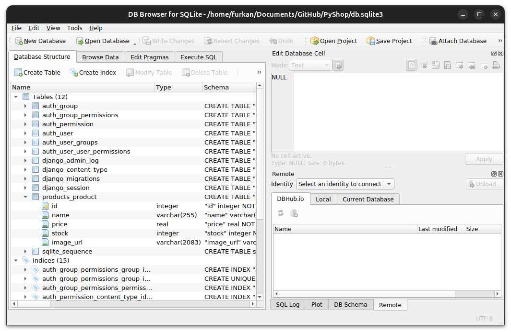
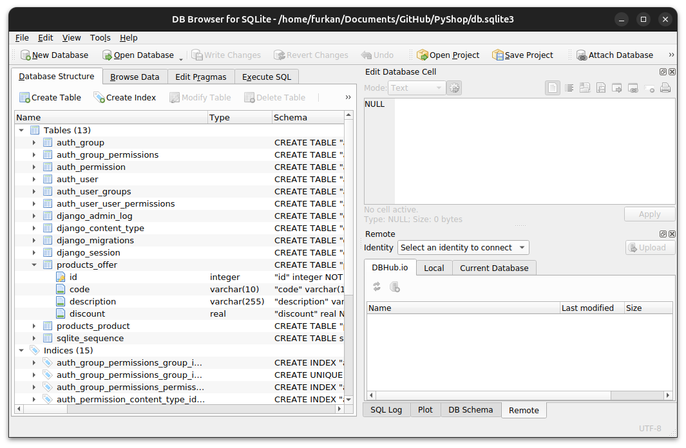
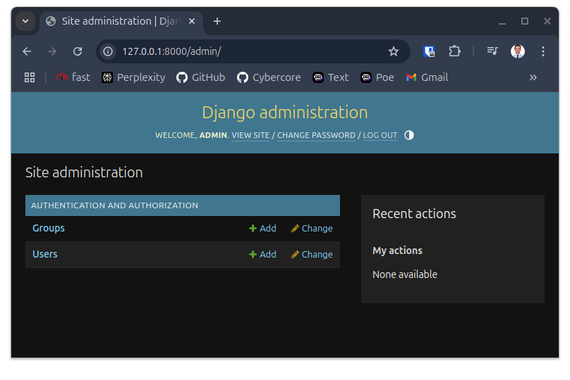
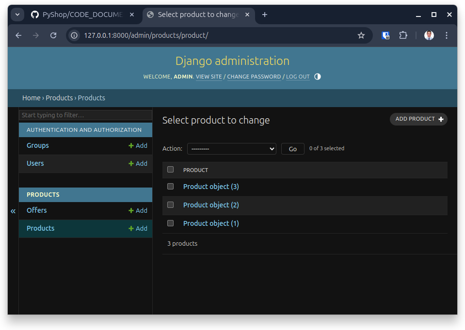
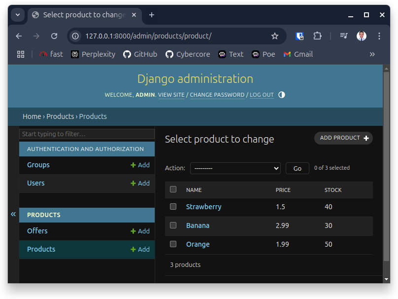
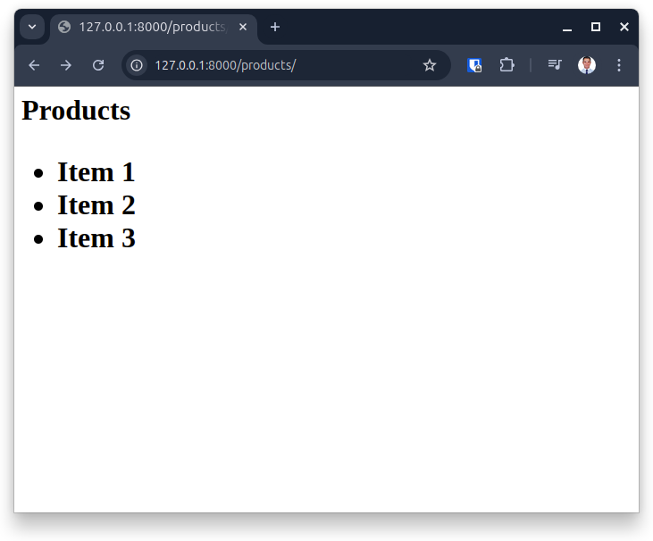
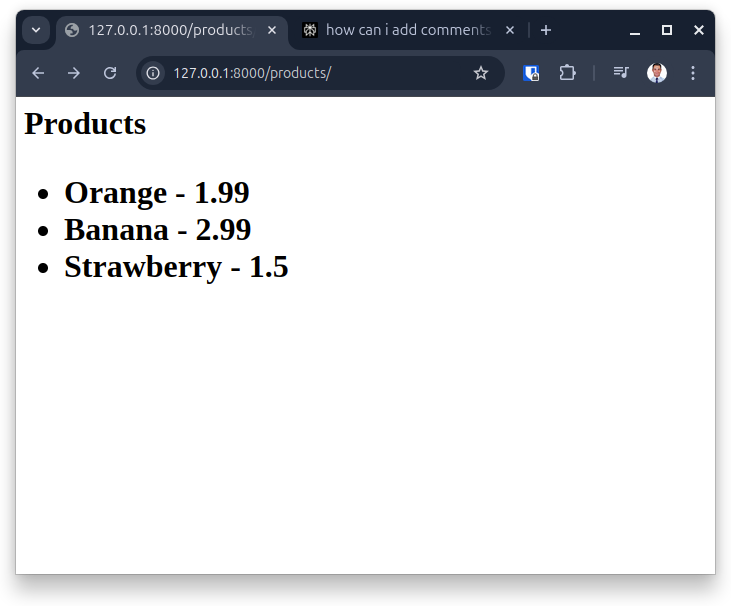

# PyShop - Django E-commerce Project

**A comprehensive learning guide for Django web development**


## Table of Contents
- [Introduction](#introduction)
- [Project Setup](#project-setup)
- [Django Project Structure](#django-project-structure)
- [Creating the Products App](#creating-the-products-app)
- [URL Mapping](#url-mapping)
- [Models and Databases](#models-and-databases)
- [Migrations](#migrations)
- [Admin Panel](#admin-panel)
- [Templates and Views](#templates-and-views)
- [Git Operations](#git-operations)
- [Additional Resources](#additional-resources)

## Introduction

This project is a Django-based e-commerce application called "PyShop." It serves as a learning resource for understanding the fundamentals of Django web development, including models, views, templates, admin panel customization, and database migrations.

This README documents the step-by-step process of building the application, providing detailed explanations of Django concepts along with practical examples. It can be used as a reference guide for future Django projects.

## Project Setup

### Creating a New Django Project

First, clone the repository and set up a virtual environment:

```bash
# Clone the repository
git clone https://github.com/furkancybercore/PyShop

# Navigate to the project directory
cd PyShop/

# Create a virtual environment
python3 -m venv venv

# Activate the virtual environment
source venv/bin/activate

# Install Django
pip install django

# Create a new Django project
django-admin startproject pyshop

# Run the development server to verify everything is working
python3 manage.py runserver
```

After verifying that the server is running correctly, press `Ctrl + C` to stop it.

### Git Workflow Setup

It's important to set up a proper Git workflow from the beginning of your project:

```bash
# Check the current branch
git branch

# Create and switch to a development branch
git checkout -b dev

# Add changes to staging area
git add .

# Commit changes
git commit -m "Created pyshop project in Django"

# Push the development branch to remote repository
git push -u origin dev

# Switch back to main branch for merging
git checkout main

# Fetch latest changes from remote
git fetch origin

# Pull the latest code from main branch
git pull origin main

# Merge development branch into main
git merge dev

# Push changes to main branch
git push origin main

# Switch back to development branch for further work
git checkout dev
```

> **Note**: In a real-world team environment, it's generally better to use pull requests for merging changes into the main branch rather than directly merging from the command line.

## Django Project Structure

After creating the project, Django creates several files automatically:

- `manage.py`: A command-line utility for interacting with your Django project
- `pyshop/`: The actual Python package for your project
  - `__init__.py`: An empty file that tells Python this directory should be considered a package
  - `settings.py`: Configuration settings for your Django project
  - `urls.py`: URL declarations for your Django project
  - `asgi.py` and `wsgi.py`: Entry points for ASGI and WSGI compatible web servers

## Creating the Products App

Django encourages a modular approach by dividing functionality into "apps." Let's create a "products" app:

```bash
# Create a new app called "products"
python3 manage.py startapp products

# Run the server to verify everything is still working
python3 manage.py runserver
```

Add these changes to Git:

```bash
git add .
git commit -m "created products app"
git push
```

### Creating Your First View

In Django, a view is a Python function that takes a web request and returns a web response. Let's create a simple view in `products/views.py`:

```python
from django.shortcuts import render
from django.http import HttpResponse


"""
All views functions always take a parameter request object.
Because when we go to a link, HTTP sends a request, 
this function takes this request object as a parameter.
"""
def index(request):
    return HttpResponse('Hello World')
```

## URL Mapping

Django uses URL patterns to map URLs to views. We need to create a URL configuration for our products app.

### Creating a URL Configuration for the Products App

Create a new file `urls.py` in the products app:

```python
from django.urls import path
from . import views # we imported views from the same directory


'''
we created this list object to keep our urls
'''
urlpatterns = [
    path('', views.index), # this is the path to the index view
]
```

### Including App URLs in the Project URLs

Now, we need to modify the main project's `urls.py` to include our app's URLs:

```python
from django.contrib import admin
from django.urls import path, include

urlpatterns = [
    path('admin/', admin.site.urls),
    path('products/', include('products.urls')) #we added this path. when user goes to this directory, it refers to products.urls.py file.
]
```

### Adding Another URL Pattern

Let's add a new URL pattern for a "new products" page:

Update `products/urls.py`:

```python
from django.urls import path
from . import views

urlpatterns = [
    path('', views.index), # this is the path to the index view
    path('new', views.new) # this is "new" directory of products app
]
```

Then add the corresponding view function in `products/views.py`:

```python
from django.shortcuts import render
from django.http import HttpResponse

def index(request):
    return HttpResponse('Hello World')

def new(request):
    return HttpResponse('New Products')
```

After making these changes, commit them to Git:

```bash
git add .
git commit -m "added /product/new directory"
git push
```

In a real team environment, you would create a pull request on GitHub:

1. Navigate to your repository on GitHub
2. Click on "Pull requests" tab
3. Click "New pull request"
4. Select the source (dev) and target (main) branches
5. Review the changes and click "Create pull request"
6. Add a title and description for the pull request
7. Click "Create pull request"
8. Review and merge the pull request

## Models and Databases

Models are Python classes that define the structure of database tables. They're the "M" in Django's "MTV" (Model-Template-View) architecture.

### Creating the Product Model

Let's create a model for our products in `products/models.py`:

```python
from django.db import models

class Product(models.Model): # Product is a class that inherits from models.Model
    name = models.CharField(max_length=255)
    price = models.FloatField()
    stock = models.IntegerField()
    image_url = models.CharField(max_length=2083)
```

Commit these changes:

```bash
git add README.md products/models.py
git commit -m "updated products/models.py"
git push
```

## Migrations

Migrations are Django's way of propagating changes you make to your models into your database schema.

### Before Migrations

Before running migrations, our database looks like this:



### Creating Migrations

When we try to create migrations initially, we get:

```bash
(venv) furkan@furkan-laptop:~/Documents/GitHub/PyShop$ python3 manage.py makemigrations
No changes detected
```

This is because Django doesn't know about our product app yet. We need to add it to `INSTALLED_APPS` in `pyshop/settings.py`:

```python
# Application definition

INSTALLED_APPS = [
    ...
    'products.apps.ProductsConfig', # add the products app to the installed apps
]
```

Now we can create migrations:

```bash
(venv) furkan@furkan-laptop:~/Documents/GitHub/PyShop$ python3 manage.py makemigrations
Migrations for 'products':
  products/migrations/0001_initial.py
    + Create model Product
```

This creates a migration file `products/migrations/0001_initial.py`:

```python
# Generated by Django 5.1.7 on 2025-03-12 14:52

from django.db import migrations, models


class Migration(migrations.Migration):

    initial = True

    dependencies = [
    ]

    operations = [
        migrations.CreateModel(
            name='Product',
            fields=[
                ('id', models.BigAutoField(auto_created=True, primary_key=True, serialize=False, verbose_name='ID')),
                ('name', models.CharField(max_length=255)),
                ('price', models.FloatField()),
                ('stock', models.IntegerField()),
                ('image_url', models.CharField(max_length=2083)),
            ],
        ),
    ]
```

### After Creating Migrations

After creating migrations, our database looks like this:



### Applying Migrations

Now, let's apply the migrations to actually modify the database:

```bash
python3 manage.py migrate
```

### Adding an Offer Model

Let's add another model for special offers:

```python
class Offer(models.Model):
    code = models.CharField(max_length=10)
    description = models.CharField(max_length=255)
    discount = models.FloatField()
```

Create and apply the migrations:

```bash
python3 manage.py makemigrations
python3 manage.py migrate
```

After applying migrations, our database now includes the Offer table:



Commit the changes:

```bash
git add .
git commit -m "created offer class"
git push
```

## Admin Panel

Django comes with a built-in admin interface that allows you to manage your data easily.

### Accessing the Admin Panel

Run the server:

```bash
python3 manage.py runserver
```

Navigate to: http://127.0.0.1:8000/admin/

### Creating a Superuser

To access the admin panel, we need to create a superuser:

```bash
python3 manage.py createsuperuser
# Username: admin
# Email: admin@mail.com
# Password: 1234
```

Now run the server again and log in to the admin panel:

```bash
python3 manage.py runserver
```

The initial admin panel looks like this:



### Registering Models in the Admin Panel

To make our models visible in the admin panel, we need to register them in `products/admin.py`:

```python
from django.contrib import admin
from .models import Product # import the Product class from the models.py file

admin.site.register(Product) # Admin object, site is attribute and object itself, 
                             # calling register method with argument Product. 
                             # This will make the Product model available in the admin interface.
```

After registiring models looks like this, to make it meaningful we need to make small changes;




### Customizing the Admin Panel

Let's customize how our products are displayed in the admin panel:

```python
from django.contrib import admin
from .models import Product

class ProductAdmin(admin.ModelAdmin): # ProductAdmin is a class that inherits from admin.ModelAdmin
    list_display = ('name', 'price', 'stock') #tuple of fields to display in the admin interface

admin.site.register(Product, ProductAdmin) # Admin object, site is attribute and object itself, 
                             # calling register method with argument Product. 
                             # This will make the Product model available in the admin interface.   

                             # We added ProductAdmin class as a second argument
                             # when registering the Product model, 
                             # Django will use the information in ProductAdmin class 
                             # to know how to represent a list of products.
                             # This will customize the way the Product model is displayed
                             # in the admin interface.
```

### Adding Offer to Admin Panel

Let's also add the Offer model to the admin panel:

```python
from django.contrib import admin
from .models import Product, Offer

class ProductAdmin(admin.ModelAdmin):
    list_display = ('name', 'price', 'stock')

class OfferAdmin(admin.ModelAdmin): ## OfferAdmin is a class that inherits from admin.ModelAdmin
    list_display = ('code', 'discount') #tuple of fields to display in the admin interface

admin.site.register(Product, ProductAdmin)
admin.site.register(Offer, OfferAdmin) # Admin object, site is attribute and object itself,
```

After these changes, the admin panel looks like this:



### Understanding Plural Names in Admin Panel

You might notice that Django automatically pluralizes model names in the admin panel. If you want to customize these names, you can use the `verbose_name` and `verbose_name_plural` options in the `Meta` class of your models:

```python
class Product(models.Model):
    name = models.CharField(max_length=255)
    price = models.FloatField()
    stock = models.IntegerField()
    image_url = models.CharField(max_length=2083)

    class Meta:
        verbose_name = "Product"
        verbose_name_plural = "Products"


class Offer(models.Model):
    code = models.CharField(max_length=10)
    description = models.CharField(max_length=255)
    discount = models.FloatField()

    class Meta:
        verbose_name = "Offer"
        verbose_name_plural = "Offers"
```

Commit the changes:

```bash
git add .
git commit -m "Edited Admin Panel2"
git push origin dev
```

## Templates and Views

Templates are Django's way of generating HTML dynamically. Let's create a template for our products page.

### Creating a Basic Template

Create a templates directory within the products app:

```bash
mkdir -p products/templates/
```

Create a basic template at `products/templates/index.html`:

```html
<h1>Products</h1>
<ul>
    <li>Item 1</li>
    <li>Item 2</li>
    <li>Item 3</li>
</ul>
```

### Updating the View to Use the Template

Now, let's update our view to use this template:

```python
from django.shortcuts import render
from .models import Product # Importing Product model from models.py file.

def index(request):
    products = Product.objects.all() # Fetch all products from database and load them to products variable.
    return render(request, 'index.html')
    # render function takes request object as a first argument. Second argument is the name of template.
    # django will look for this template in the templates directory of the app.
    # In this case, it will look for index.html in products/templates directory.
    # And render this template to the user.
```

When we navigate to the products page, it now looks like this:



### Passing Data to the Template

Let's modify our view to pass the product data to the template:

```python
def index(request):
    products = Product.objects.all() # Fetch all products from database and load them to products variable.
    return render(request, 'index.html',
                  {'products': products})

'''
   How render function works:
        Render function takes request object as a first argument. 
        
        Second argument is the name of template.
        django will look for this template in the templates directory of the app.
        In this case, it will look for index.html in products/templates directory.
        And render this template to the user.

        Third argument is the context. Context is a dictionary 
        that contains all the data that we want to pass to the template.
        In this case, we are passing products to the template.
        So, we can use this products variable in the template.
        We can use this products variable to show all products in the template.
'''
```

Now, let's update our template to use this data:

```html
<h1>Products</h1>
<ul>
     <!-- products is given as 3rd argument in render function in views.py -->
        <li>{{ product.name }} - {{ product.price }}</li>
    
</ul>
```

After these changes, our products page now displays actual product data:



### Adding Bootstrap for Styling

(Coming in a future update)

## Git Operations

Git is essential for version control in real-world projects. Here are some common Git operations that are useful to know:

### Checking Status and Log

```bash
# Check the status of your repository
git status

# View commit history
git log

# View a compact commit history
git log --oneline

# View commit history with branch visualization
git log --graph --oneline --all
```

### Working with Branches

```bash
# List all branches
git branch

# Create a new branch
git branch feature/new-feature

# Switch to a branch
git checkout feature/new-feature

# Create and switch to a new branch in one command
git checkout -b feature/another-feature

# Delete a branch (after merging)
git branch -d feature/completed-feature

# Force delete a branch (even if not merged)
git branch -D feature/abandoned-feature
```

### Undoing Changes

```bash
# Discard changes in working directory for a specific file
git checkout -- file.txt

# Discard all changes in working directory
git checkout -- .

# Unstage a file (remove from staging area)
git reset HEAD file.txt

# Create a new commit that undoes changes in a previous commit
git revert abc123

# Example scenario: reverting a specific commit
git log --oneline
# a1b2c3d Fix styling issue
# e4f5g6h Add product filtering
# i7j8k9l Initial commit

git revert a1b2c3d  # This creates a new commit that undoes the changes in a1b2c3d
```

### Advanced Git Operations

```bash
# Temporarily store changes to work on something else
git stash

# Reapply stashed changes
git stash pop

# Cherry-pick a specific commit from another branch
git cherry-pick commit_hash

# Example scenario: cherry-picking a bug fix from another branch
git checkout main
git log feature/bug-fix --oneline
# a1b2c3d Fix critical security bug
# e4f5g6h Other changes
git cherry-pick a1b2c3d  # Apply only the bug fix to main
```

### Force Pushing (Use with Caution)

```bash
# Rewrite history of the current branch
git rebase -i HEAD~3  # Interactive rebase of the last 3 commits

# Force push after rewriting history (USE WITH CAUTION)
git push --force origin branch-name

# Example scenario: cleaning up commits before merging to main
git checkout feature/messy-feature
git rebase -i HEAD~5  # Clean up the last 5 commits
git push --force origin feature/messy-feature
```

> **Warning**: Force pushing rewrites history and can cause problems for collaborators. Only use it when necessary and when you understand the implications.

## Additional Resources

For more detailed information about the code used in this project, please refer to the [Code Documentation](CODE_DOCUMENTATION.md) file.

 
 